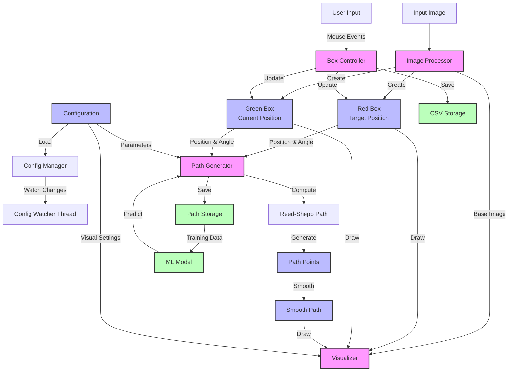

```mermaid
graph TD
    %% Main Components
    Input[Input Image] --> ImageProcessor[Image Processor]
    Config[Configuration] --> |Load| ConfigManager[Config Manager]
    ConfigManager --> |Watch Changes| ConfigWatcher[Config Watcher Thread]
    
    %% Box Management
    ImageProcessor --> |Create| RedBox[Red Box<br/>Target Position]
    ImageProcessor --> |Create| GreenBox[Green Box<br/>Current Position]
    
    %% User Interaction
    UserInput[User Input] --> |Mouse Events| BoxController[Box Controller]
    BoxController --> |Update| RedBox
    BoxController --> |Update| GreenBox
    
    %% Path Generation
    RedBox --> |Position & Angle| PathGenerator[Path Generator]
    GreenBox --> |Position & Angle| PathGenerator
    Config --> |Parameters| PathGenerator
    
    %% Path Computation
    PathGenerator --> |Compute| ReedSheppPath[Reed-Shepp Path]
    ReedSheppPath --> |Generate| PathPoints[Path Points]
    PathPoints --> |Smooth| SmoothPath[Smooth Path]
    
    %% Visualization
    ImageProcessor --> |Base Image| Visualizer[Visualizer]
    RedBox --> |Draw| Visualizer
    GreenBox --> |Draw| Visualizer
    SmoothPath --> |Draw| Visualizer
    Config --> |Visual Settings| Visualizer
    
    %% Data Storage
    BoxController --> |Save| CSVStorage[CSV Storage]
    PathGenerator --> |Save| PathStorage[Path Storage]
    
    %% Machine Learning Components
    PathStorage --> |Training Data| MLModel[ML Model]
    MLModel --> |Predict| PathGenerator
    
    %% Styling
    classDef process fill:#f9f,stroke:#333,stroke-width:2px
    classDef data fill:#bbf,stroke:#333,stroke-width:2px
    classDef storage fill:#bfb,stroke:#333,stroke-width:2px
    
    class ImageProcessor,PathGenerator,BoxController,Visualizer process
    class RedBox,GreenBox,PathPoints,SmoothPath,Config data
    class CSVStorage,PathStorage,MLModel storage
``` 